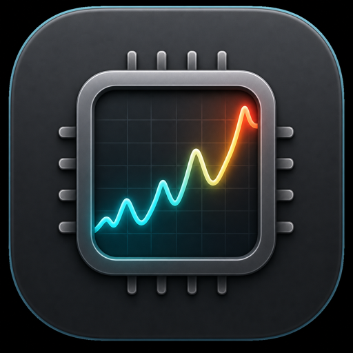

# PulseBar

<p align="center">
  
</p>

PulseBar is a native macOS menu bar system monitor for quickly checking live Mac performance from the top bar.

It focuses on compact real-time visibility, a polished popover panel, and detailed customization for how each metric appears in the menu bar.

## Download

Download the latest stable release:

- [PulseBar 1.0](https://github.com/ckj002/PulseBar/releases/tag/v1.0)
- [PulseBar-latest.zip](https://github.com/ckj002/PulseBar/releases/download/v1.0/PulseBar-latest.zip)

## Features

- Native Swift + SwiftUI macOS app
- macOS 15 or later
- Universal build for Apple Silicon and Intel Macs
- Menu bar app with no Dock icon by default
- Compact menu bar widgets for CPU, memory, disk, network, CPU temperature, fan speed, and dark/light mode switching
- iStat-style small popover panel with an original PulseBar design
- Optional launch at login

## Monitoring

- CPU usage with real-time graph
- Memory usage with percentage and usage visualization
- Network upload/download speed
- Total sent/received network data and measured duration
- Disk free space and capacity bar
- CPU temperature with graceful fallback when unavailable
- Fan RPM with graceful fallback when unavailable

## Customization

PulseBar includes extensive display controls:

- Show or hide each menu bar metric
- CPU, memory, network, disk, temperature, fan, and theme menu bar items
- Per-metric label, value, and unit visibility
- Per-metric text sizes
- Graph and gauge sizing
- Label-to-graph, graph-to-value, and value-to-unit spacing
- Horizontal inset controls
- CPU graph display duration
- Disk decimal capacity display
- Graph border color
- Gradient mode for usage-based colors
- Low, mid, and high gradient colors
- Dark/light mode toggle directly from the menu bar

## Thermal And Fan Support

CPU temperature and fan RPM depend on hardware and macOS sensor access. PulseBar handles unavailable sensors safely and keeps the app running even when a value cannot be read.

## Permissions

PulseBar may ask for permission to control System Events when using the menu bar dark/light mode toggle. This is only used to switch the macOS appearance setting.

## Build

Open the project in Xcode and build the `SystemPulse` scheme. The produced app is named `PulseBar.app`.

```bash
xcodebuild -project SystemPulse.xcodeproj \
  -scheme SystemPulse \
  -configuration Release \
  -destination generic/platform=macOS \
  ONLY_ACTIVE_ARCH=NO build
```

## Release

Version `1.0` is the first stable release of PulseBar.

The latest built app archive is available in:

- `AppBuild/PulseBar-latest.zip`

## License

PulseBar is licensed under the MIT License.

See [LICENSE](LICENSE) for the full license text.
